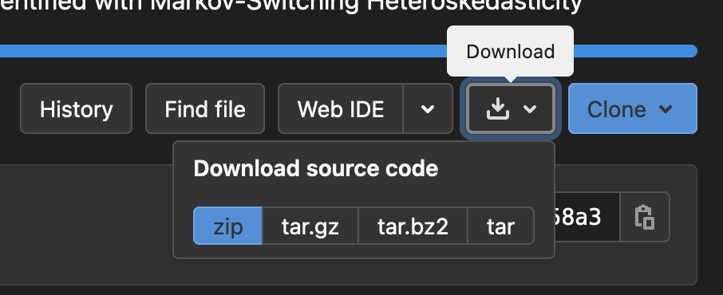

# BayesianMS-VAR-GC
### Bayesian Estimation of Markov-Switching VARs for Granger Causal Inference in R

by Matthieu Droumaguet, Anders Warne, \& Tomasz Woźniak

> **Summary.** A block Metropolis-Hastings algorithm for the Bayesian estimation of the Markov-switching Vector Autoregressive models with restrictions for Granger noncausality is provided, as well as an appropriate estimator for the marginal data density. 
>
> **Keywords.** R, Markov-switching VARs, Block Metropolis-Hastings Sampler, Marginal Data Density

## Citation

To refer to the codes in publications, please, cite the following paper:

> Droumaguet, M., Warne, A., Woźniak, T. (2017) Granger Causality and Regime Inference in Markov-Switching VAR Models with Bayesian Methods, *Journal of Applied Econometrics*, 32(4), pp. 802--818, DOI: [10.1002/jae.2531](http://doi.org/10.1002/jae.2531).

## Project contents

The project's file structure includes:

- [`BayesianMSVAR.pdf`](https://gitlab.com/tomaszwozniak/BayesianMS-VAR-GC/-/blob/master/BayesianMSVAR.pdf) - a document presenting the model, main functions, and their application
- `BayesianMSVAR-example.R` - a file presenting code application for a simple example
- `BayesianMSVAR` - a folder containing the functions for the estimation of the considered models
- `ReproductionScripts` - a folder containing scripts for the reproduction of all the results contained in the JAE paper
- `data.csv` and `data.RData` - data used in the paper

## Downloading the codes

To download the codes simply click on the download icon on the top of this page

and select the format of the compressed file to be downloaded.

## Forking and contributing 

You can also choose to fork the project and clone your copy from the repository. Just follow the steps (requires a [GitLab account](https://gitlab.com)):

1. **On this page:** fork the project by clicking the icon on the top of this page ([more info](https://docs.gitlab.com/ee/user/project/repository/forking_workflow.html#creating-a-fork))

   

2. **On you computer:** clone the repository you have just forked to create its local copy that you can work with.

3. **Optional:** if you find a bug or if you improve the code, please feel free to submit a pull/merge request. ([more info](https://docs.gitlab.com/ee/topics/gitlab_flow.html#mergepull-requests-with-gitlab-flow))
